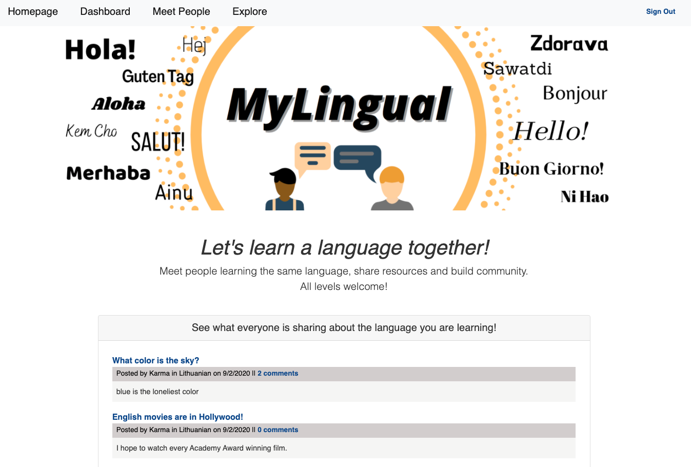

# MyLingual
An interactive social network that connects people learning the same languages!

## Table of contents
* [General info](#general-info)
* [Deployed Link](#deployed_link)
* [Screenshots](#screenshots)
* [Setup](#setup)
* [Code](#code)
* [Licenses](#licenses)
* [Inspiration](#inspiration)
* [Future Developments](#future_developments)
* [Contact](#contact)

## General info
This is a web based interactive social network used to connect people who are learning the same languages. The users can post links to helpful resources, like articles, videos, and songs that will help other language learners immerse themselves in a knowledge-filled community. When users log-in, they see posts by other people learning the same language, they can explore posts in additional languages, and meet other language learners. MyLingual makes learning a language with others fun and easy! 

## Deployed Link
[MyLingual](https://fathomless-reef-91284.herokuapp.com/)

## Screenshots

## Setup
* Clone GitHub repository 
* run npm install
* run npm i sequelize
* run npm i mysql2
* run npm i express
* run npm i express-session
* run npm i express-handlebars
* run npm i dotenv
    * Create an .env file to add your mysql database, username, and password. 

* Run 'npm start' to enter the application.
    * User will need Insomnia Core to access the routes

## Code and Technologies
* HTML 
* CSS
* Bootstrap
* JavaScript
* Node.js
* mySQL
* Express.js
* Handlebars.js
* Sequelize
* Dotenv 
* Express-session
* Bcrypt

## Licenses
* MIT license
* ISC

## Inspiration
UCLA week 15 and 16 Project and to help people practice their language skills in a community setting!

This project idea was created by Lauren Euge (leuge) and coded by Briana daMota, Rochelle Ruiz, Lauren Euge, and Alex Chigas. 

## Future Developments
* Implement functionality for official profile creation, which will populate the "Meet People" page. 
* Implement functionality for 1-on-1 chat, so people can fully interact with one another. 
* Allow photo uploads, primary language, and level identifiers on "Dashboard" page. 
* Connect media types to posts to allow users to search by categories on "Explore" page. 
* Allow users to search by language type on "Explore" page. 
* Pull in a translation API for posts. 
* Allow for larger inputs of posts for classes to upload thier materials for people to reference. 
* Connect people with tutors. 

## Contact
* Briana daMota (bdamota)
* Alex Chigas (Achigas)
* Rochelle Ruiz (rcelevante)
* Lauren Euge (leuge)
